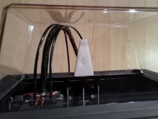
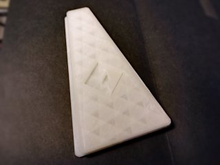

# FlashForge Creator Pro hood insert 2.0
*3D printable hood insert to reduce drafts in the FlashForge Creator Pro 2016 and similar (formerly thing:1918136)*

### License
[Creative Commons - Attribution - Share Alike](https://creativecommons.org/licenses/by-sa/4.0/)

### Attribution
This is a remix of Jangles1981's hood insert sleeve for the FFCP ([Thingiverse thing:1717566](https://www.thingiverse.com/thing:1717566)), with the logo taken from Vexelius' Filament tube holder ([Thingiverse thing:1557250](https://www.thingiverse.com/thing:1557250)).

### Gallery

[🔎](images/photo1.jpg) [🔎](images/photo2.jpg)

## Description and Instructions

Here's another entry in my long tradition of improving existing designs: this is a remix of Jangles1981's hood insert sleeve for the 2016 FFCP (it might fit newer models as well). A sleeve like this reduces the gap in the hood to a minimum, so the heat escapes less easily during ABS prints. You don't need this for PLA prints (you should remove the hood entirely for those) unless you would be printing in an insanely cold room.

This remix has a more slicer-friendly model (Slic3r wouldn't even render the original), more accurate dimensions, smoothed corners, and a design that can be easily printed without supports. It comes in two versions, a solid one and a hollow one that requires less material to print. Either version is available with or without a FlashForge logo.

To install it, first mount the hood as usual, then push the two ‘flaps’ of the hood inside to easily insert the sleeve, with the widest part pointing outward.

This goes well with [tim_sweden's door handle draft stopper](https://www.thingiverse.com/thing:1697301) on the 2016 FFCP, to provide a draft-free enclosure. I noticed how well the enclosure was sealed when I opened the door in the middle of an ABS print, and immediately heard it crack from the thermal shock. Avoid opening the door unless you have no other choice!

### Print Settings I've used

I printed this with 0.2 mm layers, 20% infill, no supports and no raft, using Velleman glow-in-the-dark PLA (just because I couldn't figure out what else to do with 1 kg of the stuff).

I would recommend to print this in a flexible filament if you can. This will make installation easier, and reduce or eliminate rattling sounds, which is one of the issues I have with my PLA print. If you print it in an elastic filament, it may be better to scale up the X and Y dimensions by a fraction of a percent (about 0.33% would be good), and scale down the Z dimension by about 5%, so it really clamps itself to the hood.
If you print it in a rigid filament, rattling sounds may be reduced by sticking a thin rubber strip to the bottom edge (e.g. a strip of cut-up bicycle tyre).

## Updates

### 2016/11/26

First publication on Thingiverse.

### 2021/03/20

Migrated to GitHub, made minor tweaks to solid model and added hollow variant.

## TAGS
`ABS`, `FFCP`, `FFCPRo`, `heat`, `heated_enclosure`, `hood`